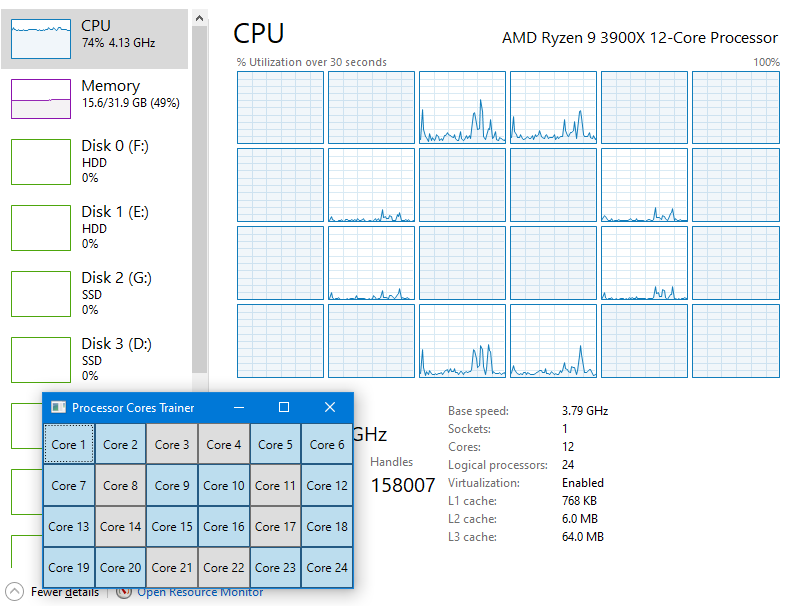

# ProcessorCoresTrainer
Library, console and WPF applications to 100% utilize specific processor cores.

## How to run
* Requires .Net Core 3.1
* Requires Windows (may throw PlatformNotSupported exception for process affinity code on other operating systems)
* `dotnet run --project ConsoleApp` for console application
* `dotnet run --project WpfApp` for windows application
